

# Hello Everyone

disini saya ingin menjelaskan sedikit tutorial

sebelumnya harus membeli domain terlebih dahulu untuk custom domain tapi saya lupa screenshot pembelian domain ini saya beli melalui niagahoster

1. how to sign up to netlify
2. how to autodeployment
3. how to connect your custom domain to your website

pertama kita masuk ke netlifinya terlebih dahulu

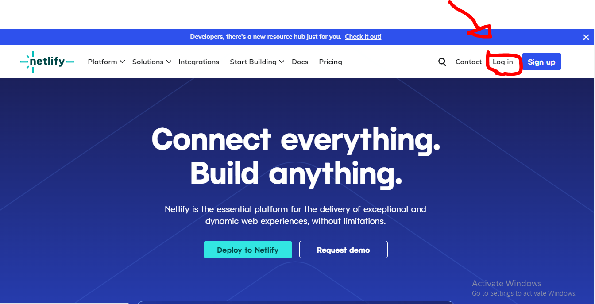
karena saya mau hosting dari file repository yg di github jadi saya masuk menggunakan github
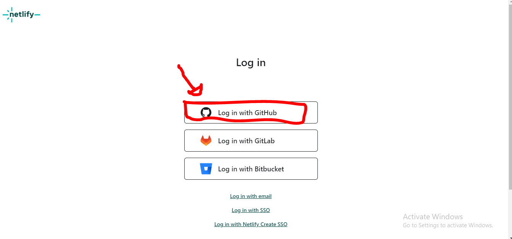
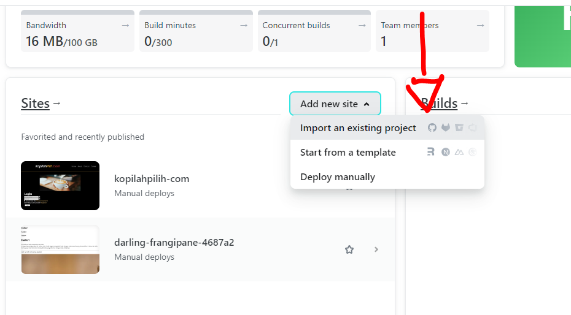
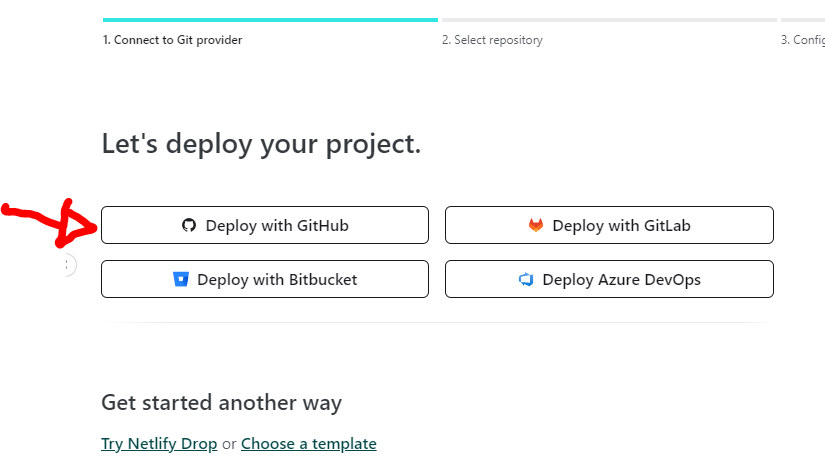
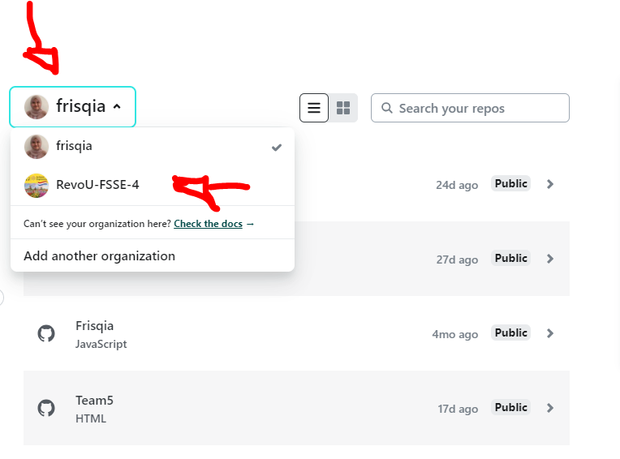

sebelumnya ini github repositorynya priate karena milik revoU lalu di rubah menjadi public agar bisa di hosting

setelah di hosting untuk mengubah alamat url klik menu domain kemudian
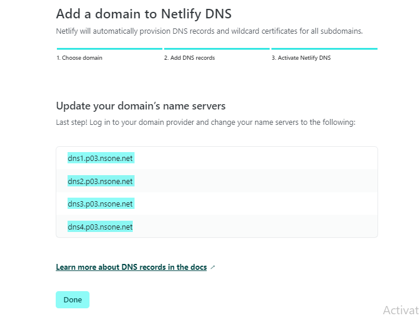
copi domain name seerver pada netlify lalu
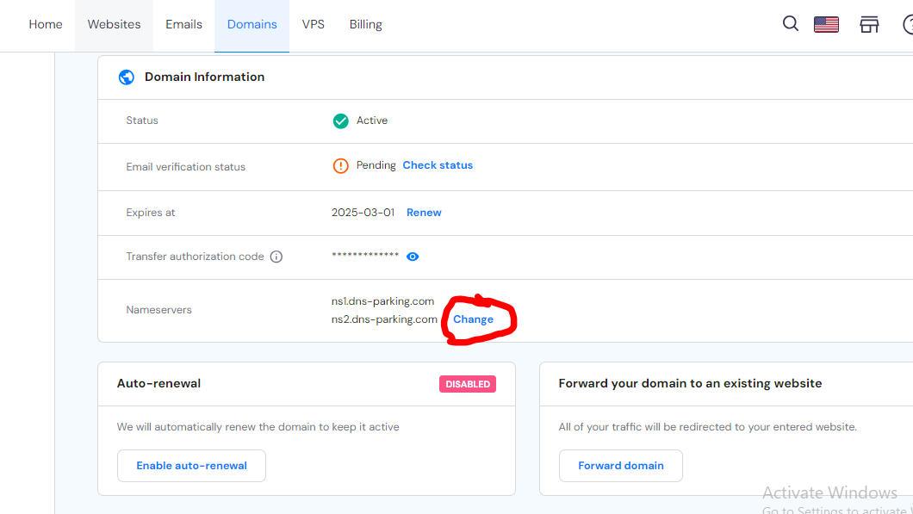
paste ke dalam cutom name yang sudah d buat di niaga hoster pada menu change seperti di gambar
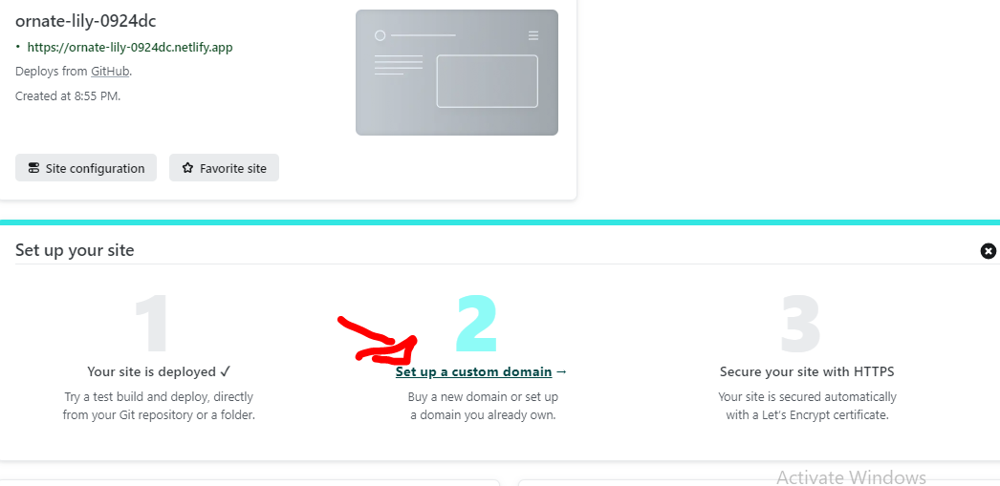
jika sudah kembali ke netlify pilih menu site overview kemudian set up and custom domain
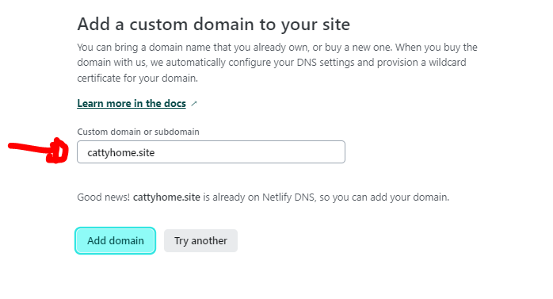 kemudian masukan domain yg sudah dibuat klik tombol add domain
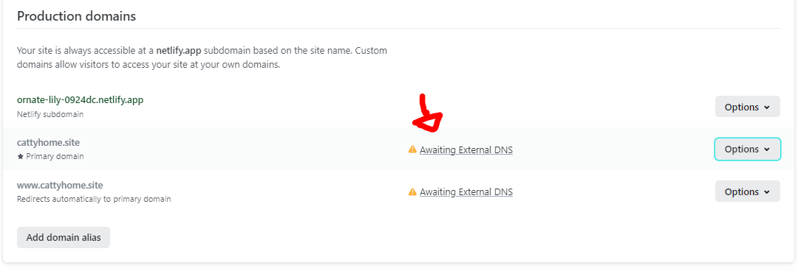
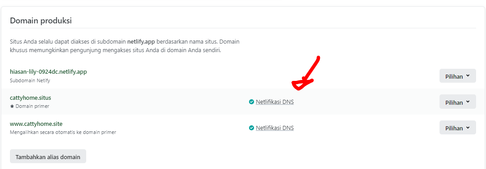
lalu tunggu kurang lebi 1 X 24 jam untuk keberhasilan domain itu terhubung

berikut ini adalah website yang sudah berhasil di hostiing
[www.cattyhome.site](www.cattyhome.site)
